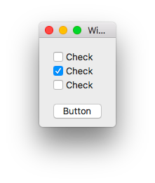

Use Cocoa Bindings to conditionally enable a button if one or more checkbox are checked.

Take away is to use KVO [Registering Dependent Keys](https://developer.apple.com/library/content/documentation/Cocoa/Conceptual/KeyValueObserving/Articles/KVODependentKeys.html).




1. Use a dynamic variable with computed properties:

```swift
    dynamic var atLeastOneSelectedCheckbox: Bool {
        return [checkbox1, checkbox2, checkbox3].contains(where: { $0.state == NSOnState })
    }
```

2. Then make sure it gets computed everytime the state of a checkbox changes with: 

```swift
    dynamic class func keyPathsForValuesAffectingAtLeastOneSelectedCheckbox() -> Set<String> {
        return ["checkbox1.cell.state",
                "checkbox2.cell.state",
                "checkbox3.cell.state"]
    }
```

3. And set the binding of the button to self. atLeastOneSelectedCheckbox

